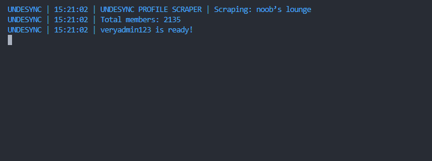

# Discord Profile Scraper
A simple script to retrieve usernames, IDs, avatars, and banners from members of a Discord guild.

## Configuration
1. Install the required packages with `npm install`.
2. Fill in the `config.json` file with the required information.
3. Ensure the token is associated with an account that is already in the guild.
4. Run the script using `npm start`.

## Misc
- The token must be valid.
- The guild must be accessible by the token (the bot or user account must be in the guild).
- No rate limits have been encountered so far, based on testing.
- The Banners will be saved using this size `4096` you can change it in `modules/discordClient.js` lines `51-52`

## Config
```json
{
    "bot" : {
        "token":"YOUR TOKEN", // The token of the user/bot to be used for scraping the guild.
        "guild":"THE GUILD ID" // The guild ID to scrape.
    },

    "save":{
        "maxScrapes": 0, // The maximum number of scrapes to save. [0 = unlimited]

        "username": true, // Save the username of the member.
        "id": true, // Save the id of the member.
        "avatar": true, // Save the avatar of the member.
        "banner": true // Save the banner of the member.
    }
}
```
#
### Example


[Discord](https://discord.gg/undesync)